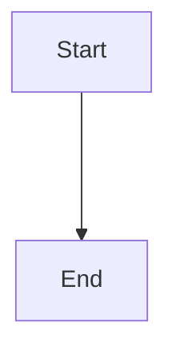

# Some text

Some other text.

## Second level

* I'm in *the second level* and **in bold**
* <https://ulusofona.pt>
* [Lusófona!](https://ulusofona.pt)
  * Second level list
  * More in second level

$x=\frac{x+1}{y}$

```
This is verbatim text!
```


```python
print("Hello world!")
```

## Inception!

```markdown
# This is formatted mardown!

Plain text
```

## Flowchart with mermaid

